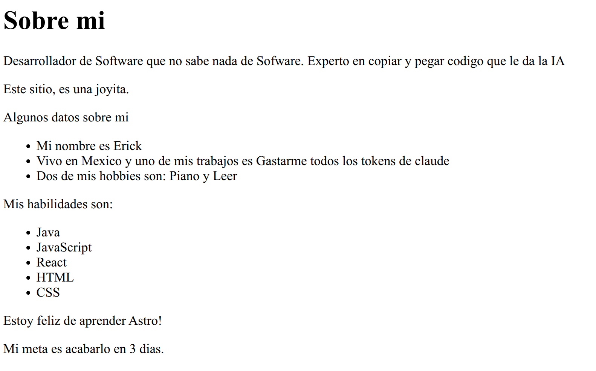

# Astro
Astro es un framework para el desarrollo web.

Una de las ventajas de Astro es que tiene código JavaScript arriba. Como mencioné, puedes escribir ese código JavaScript e inmediatamente usarlo en HTML.

Por ejemplo, para añadir contenido dinámico es muy sencillo. 

```jsx
---
const pageTitle = 'Sobre mi';

const identity = {
    firstName: "Erick",
    country: "Mexico",
    occupation: "Gastarme todos los tokens de claude",
    hobbies: ["Piano","Leer","Ajedrez"],
}

const skills = ["Java","JavaScript","React","HTML","CSS"]
---
```

Definiendo estas variables, nosotros las podemos utilizar en el HTML usando el símbolo **{}**.

```html
<h1>{pageTitle}</h1>
        <p>Desarrollador de Software que no sabe nada de Sofware. Experto en copiar y pegar codigo que le da la IA</p>
        <p>Este sitio, es una joyita.</p>
        
        <p>Algunos datos sobre mi</p>
        <ul>
            <li>Mi nombre es {identity.firstName}</li>
```

Por ejemplo, para poner un array de varios elementos de una, lo que se debe de usar es la función **map**.

```jsx
        <p>Mis habilidades son:</p>
        <ul>
            {skills.map((skill) => <li>{skill}</li>)}
        </ul>
```

Lo que hace esta función es, agarrar todo el array, e ir moviendo cada posición del array, poniendo el valor en la variable **skill**.

## Renderizado condicional 
En tu script (o sea la parte de arriba de JS), puedes elegir qué renderizar y qué no. 

Por ejemplo, hay que poner 3 variables.

```jsx
const happy = true;
const finished = false;
const goal = 3;
```

Y en el codigo HTML, solo ponemos las siguientes lineas.

```HTML
{happy && <p>Estoy feliz de aprender Astro!</p>}

{finished && <p>Ya acabe este tutorial!</p>}

{goal === 3 ? <p>Mi meta es acabarlo en 3 dias.</p> : <p>Mi meta no son 3 dias.</p>}
```

Aquí lo que pasa es que nosotros pusimos que la variable happy sea verdadera, por lo cual Astro checa si la variable es verdadera; si lo es, entonces renderizará el elemento. Y de hecho lo podemos ver con finished, este no se renderiza.



## Estilos

Usando la etiqueta Styles, le puedes agregar estilos a tu página.

```html
        <style>
        h1 {
            color: purple;
            font-size: 4rem;
        }
        </style>
```

También puedes agregar clases, con la palabra reservada "class".

```html
        .skill{
            color: green;
            font-weight: bold;
        }

        <ul>
            {skills.map((skill) => <li class="skill">{skill}</li>)}
        </ul>
```

## Usar variables CSS
La etiqueta Style también es capaz de referenciar variables que estén declaradas en tu script.

```jsx
const skillColor = "crimson";
        <style define:vars={{skillColor}}>
        h1 {
            color: purple;
            font-size: 4rem;
        }
        .skill{
            color: var(--skillColor);
            font-weight: bold;
        }
```

## Estilos globales
Hay una forma de afectar los estilos de manera global, y esa es creando un archivo .css.

Este archivo lo debes de importar hasta mero arriba de tu archivo .astro. Así:

```jsx
---
import './styles/global.css'

const pageTitle = 'Sobre mi';

const identity = {
    firstName: "Erick",
    country: "Mexico",
    occupation: "Gastarme todos los tokens de claude",
    hobbies: ["Piano","Leer","Ajedrez"],
}

const skills = ["Java","JavaScript","React","HTML","CSS"]

const happy = true;
const finished = false;
const goal = 3;

const skillColor = "crimson";
const fontWeight = "bold";
const textCase = "uppercase"
---
```
