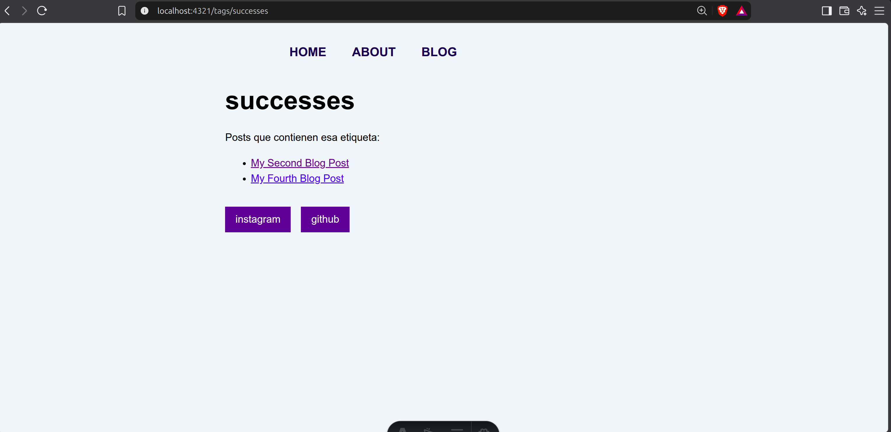

# Unidad 5

## Crear un archivo post
Vamos a hacer que se agregue la lista de post que tenemos dinámicamente.

```jsx
const allPosts = Object.values(import.meta.glob('./posts/*.md', { eager: true }));
```
Agregaremos esta línea a nuestro blog.astro.

Uno de los errores que yo tuve fue agregar todos estos posts en todas las páginas (o sea que en BaseLayout estuvieran todos los enlaces), por lo cual vamos a quitar eso de BaseLayout y vamos a poner solo los enlaces en blog.astro.

Una vez que hayamos agregado esa línea en blog.astro, ahora, en vez de nosotros tener que ir creando el enlace uno por uno, ahora solo ponemos esto:

```jsx
 <ul>
 {allPosts.map((post: any) => <li><a href={post.url}>{post.frontmatter.title}</a></li>)}
 </ul>
```

Y de esa forma, cuando nosotros agreguemos más posts, se agregarán dinámicamente.

Ahora, nosotros de hecho podemos componentizar esto. Esto es muy sencillo, creamos un nuevo archivo llamado BlogPost, y definiremos las variables que queremos pasar dinámicamente y cómo las usaremos.

```jsx
---
const {title} = Astro.props
const {url} = Astro.props
---
<li><a href={url}>{title}</a></li>
```

Y en nuestro blog.astro, solo cambiamos la línea que agregamos por esta otra:

```jsx
{allPosts.map((post: any) => <BlogPost url={post.url} title={post.frontmatter.title} />)}
```

## Tag Pages
Este es un tema un poco más complejo, pero, recordando que en nuestros archivos markdown tenemos tags, nosotros podemos buscar esos archivos mediante esas tags; podemos poner que nos muestren los archivos con ciertas tags. Por lo cual, para esto, crearemos una nueva carpeta llamada tags, y un archivo llamado [tag].astro.

En este archivo pondremos todo este código:

```jsx
---
import BaseLayout from '../../layouts/BaseLayout.astro';
import BlogPost from '../../components/BlogPost.astro'

export async function getStaticPaths() {
  const allPosts = Object.values(import.meta.glob('../posts/*.md', { eager: true }));

  return [
    {params: {tag: "astro"}, props: {posts: allPosts}},
    {params: {tag: "successes"}, props: {posts: allPosts}},
    {params: {tag: "community"}, props: {posts: allPosts}},
    {params: {tag: "blogging"}, props: {posts: allPosts}},
    {params: {tag: "setbacks"}, props: {posts: allPosts}},
    {params: {tag: "learning in public"}, props: {posts: allPosts}}
  ];
}

const { tag } = Astro.params;
const { posts } = Astro.props;
const filteredPosts = posts.filter((post: any) => post.frontmatter.tags?.includes(tag));
---
<BaseLayout pageTitle={tag}>
  <p>Posts que contienen esa etiqueta:</p>
  <ul>
    {filteredPosts.map((post: any) => <BlogPost url={post.url} title={post.frontmatter.title}/>)}
  </ul>
</BaseLayout>
```

Ahora, explicando un poco este código, getStaticPath devuelve un array de las rutas de las páginas; esto quiere decir que si nosotros buscamos esa página en específico, nos dará la página, como se puede ver en la imagen:



Aparte de eso, como podemos ver, estamos usando la plantilla de BlogPost, para que nos muestre exactamente los posts que contengan esas tags.

## Generar páginas con tags existentes.
Uno de los problemas que tenemos ahora mismo es que, si nosotros pusiéramos otra tag en los archivos md, tendríamos que venir a [tag].astro a agregar esa tag, y bla bla bla. Nosotros queremos que eso se haga dinámicamente, por lo cual haremos lo siguiente:

```jsx
---
import BaseLayout from '../../layouts/BaseLayout.astro';
import BlogPost from '../../components/BlogPost.astro'

export async function getStaticPaths() {
  const allPosts = Object.values(import.meta.glob('../posts/*.md', { eager: true }));
      const uniqueTags = [...new Set(allPosts.map((post: any) => post.frontmatter.tags).flat())];


  return uniqueTags.map((tag) => {
  const filteredPosts = allPosts.filter((post: any) => post.frontmatter.tags.includes(tag));
  return {
    params: { tag },
    props: { posts: filteredPosts },
  };
});
}

const { tag } = Astro.params;
const { posts } = Astro.props;
---
<BaseLayout pageTitle={tag}>
  <p>Posts que contienen esa etiqueta:</p>
  <ul>
    {posts.map((post: any) => <BlogPost url={post.url} title={post.frontmatter.title}/>)}
  </ul>
</BaseLayout>
```

Y ahora de esa manera se crean dinámicamente. Vamos a explicar un poco lo que hace cada cosa.

## Construyendo un tag index
Haremos una página index para las tags; esto será para que nosotros podamos acceder a la página de una tag en específico que queramos.

Crearemos la página index.astro, pero en la página tags. En esta, debemos poner un array de los tags que vamos a poner, pero, como bien habíamos dicho antes, si nosotros agregáramos más tags, las tendríamos que agregar manualmente, por lo cual no sería algo recomendable. Entonces, usaremos la solución que pusimos en la otra página de tags: sacar todas las tags de todos los markdowns que tengamos disponibles.

```jsx
---
import BaseLayout from '../../layouts/BaseLayout.astro';
const allPosts = Object.values(import.meta.glob('../posts/*.md', { eager: true }));
const tags = [...new Set(allPosts.map((post: any) => post.frontmatter.tags).flat())];
const pageTitle = "Tag Index";
---
```
Ahora, debemos renderizar todas esas tags en nuestra página web; para eso usaremos la plantilla BaseLayout, y con la función map renderizaremos todas las tags que tenemos.

```jsx
<BaseLayout pageTitle={pageTitle}>
  <div>{tags.map((tag) => <p>{tag}</p>)}</div>
</BaseLayout>
```

Y para hacer que cada tag nos lleve a su respectiva página, pues solo tendremos que poner la etiqueta a, para el link.

```jsx
<BaseLayout pageTitle={pageTitle}>
  <div>
    {tags.map((tag) => (
      <p><a href={`/tags/${tag}`}>{tag}</a></p>
    ))}
  </div>
</BaseLayout>
```

## RSS feed
Ahora, le agregaremos un RSS a la página. Lo primero que debemos hacer es instalar el paquete de RSS en nuestro proyecto, por lo cual pondremos este comando.

```bash
npm install @astrojs/rss
```

Ahora, crearemos un nuevo archivo, llamado rss.xml.js. En este archivo, le pondremos todo lo que queremos que muestre nuestro XML.

```JavaScript
import rss, { pagesGlobToRssItems } from '@astrojs/rss';

export async function GET(context) {
  return rss({
    title: 'Astro Learner | Blog',
    description: 'My journey learning Astro',
    site: context.site,
    items: await pagesGlobToRssItems(import.meta.glob('./**/*.md')),
    customData: `<language>en-us</language>`,
  });
}
```
